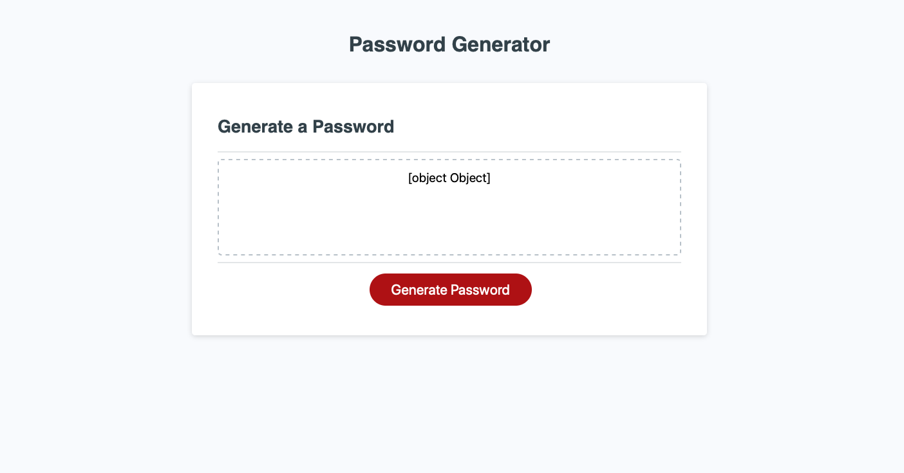

# password-generator-

Description

It is time to start learning Javascript! This exercise is all about understanding the basics of javascipt and being able to use everything we know to develop an interactive program. 

The process for the random password generator is a complicated one. That is why I saw fit to write out pesuocode first. I believe it is easier to write out step by step what needs to be done and then turn each step into code. This assignment contained arrays, prompts, confirms, console.logs, functions, objects and random number generators. I believe it was important to start off this javascript code with writing out all arrays that would be called out to. Next, I wrote out all of the prompts and confirms that asks the user for important information. Once all of the questions were writen up, this is where things became tricky. I believed it was best to create an object with all of the potential options and then to write out a new function with all of the chosen conditions to be sent to the random generator. 

It is important as a future developer to be able to shown what the client needs done and to be able to replicate it! During this assignment we were shown and informed on the requirements of the password generator, but it was up to us to write up the best way we saw fit to create it. This is an assignment that could have been done many different ways and it shows each person who examines our work our thought process. 

Potential future projects for this excersise is to be able to link this random password with a username to create and account for future websites. 

Acceptance Criteria 

```
GIVEN I need a new, secure password
WHEN I click the button to generate a password
THEN I am presented with a series of prompts for password criteria
WHEN prompted for password criteria
THEN I select which criteria to include in the password
WHEN prompted for the length of the password
THEN I choose a length of at least 8 characters and no more than 128 characters
WHEN prompted for character types to include in the password
THEN I choose lowercase, uppercase, numeric, and/or special characters
WHEN I answer each prompt
THEN my input should be validated and at least one character type should be selected
WHEN all prompts are answered
THEN a password is generated that matches the selected criteria
WHEN the password is generated
THEN the password is either displayed in an alert or written to the page
```

Usage

To be able to view this site you can visit my Github profile. This site is also listed below:

- https://jenniferfunchess.github.io/password-generator-/

- https://github.com/JenniferFunchess/password-generator-

__

Below are photos of the completed password generator:




Credits

Thank you to each of the websites below for their help in completeing this assignment. 

https://www.w3schools.com/jsref/jsref_random.asp

https://developer.mozilla.org/en-US/docs/Web/JavaScript/Reference/Global_Objects/Math/random

https://youtube.com

https://stackoverflow.com/questions/1527803/generating-random-whole-numbers-in-javascript-in-a-specific-range


HTML Validation

Each HTML document along with the CSS stylesheet has been validated and corrected with help of:
https://validator.w3.org/nu/#textarea

Contributing

Thank you to my wonderful tutor, Sean Brown-Byfield, for helping me with this assignment! 